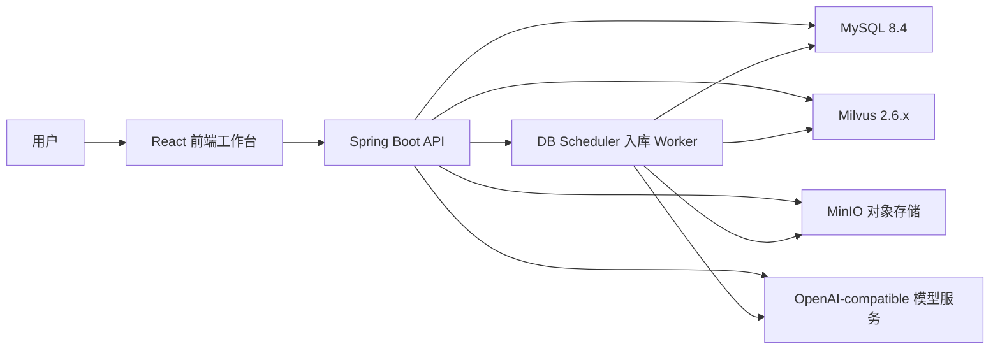
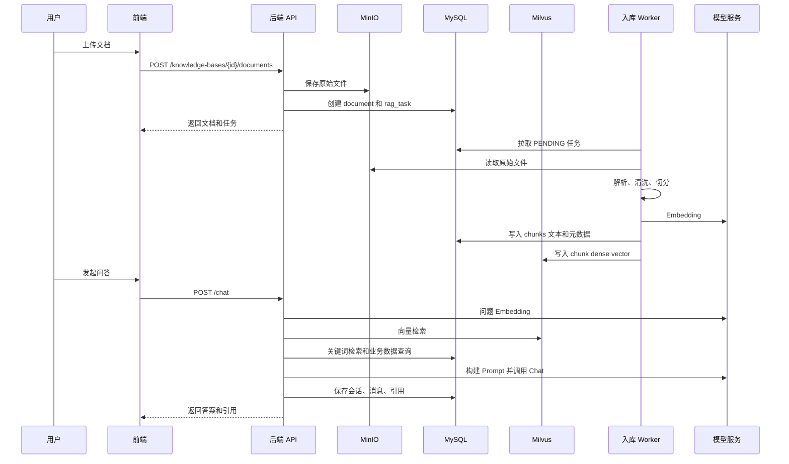

# 总体架构设计

## 架构概览

系统由前端工作台、Spring Boot 后端、MySQL、Milvus、MinIO、OpenAI-compatible 模型服务组成。MySQL 是业务事实库，保存用户、知识库、文档、任务、切片文本、会话和引用；Milvus 是可重建的向量索引库，保存切片向量并提供语义相似性检索。

## RAG 主流程

## 后端分层

- Controller：接收 HTTP 请求，做参数校验，返回统一响应。
- Service：承载业务逻辑，如认证、知识库、文档、检索、问答。
- Mapper：MyBatis-Plus 数据访问。
- Domain：实体和枚举。
- Infrastructure：MinIO、模型客户端、OpenAPI、生产安全检查。
- Worker：基于 DB 任务表的异步入库调度。

## 前端架构

- `App.tsx`：路由和登录保护。
- `pages/`：登录、工作台、知识库列表、知识库详情。
- `lib/api.ts`：Axios 实例、token 注入、统一错误处理。
- `components/ui.tsx`：基础 UI 组件。
- TanStack Query：服务端状态、缓存、轮询、重试。

## 部署结构

开发环境推荐：

- Docker Compose 启动 MySQL、Milvus 和 MinIO。
- 本机 JDK 17 启动 Spring Boot。
- Vite 启动前端，代理 `/api` 到后端。

生产环境建议：

- 后端、前端、数据库、对象存储分离部署。
- 使用外部密钥管理注入敏感环境变量。
- 后续可将关键词检索扩展到 OpenSearch，向量索引继续以 Milvus 为主。
