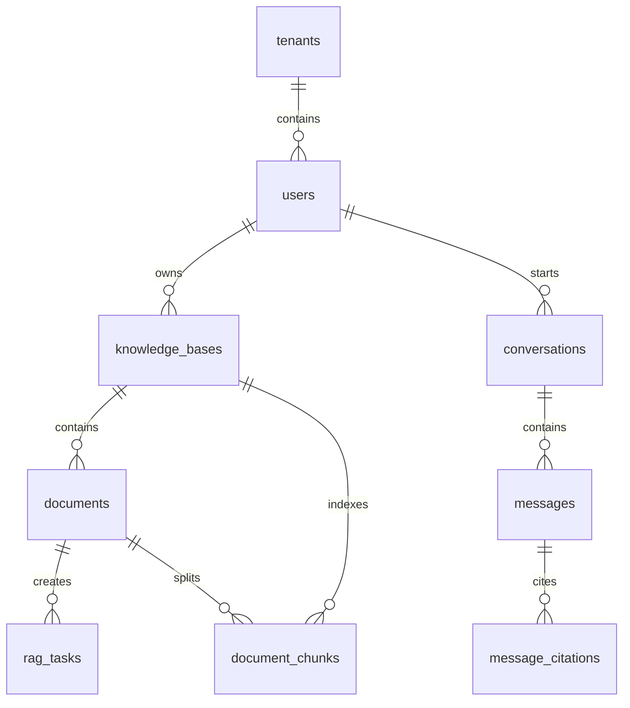

# 数据库设计

## 数据库选型

当前版本使用 MySQL 8.4 作为业务数据库，使用 MyBatis-Plus 访问数据，主键统一采用 `BIGINT` 雪花 ID。

MySQL 保存系统事实数据：

- 用户、角色、租户。
- 知识库、成员权限。
- 文档元数据、入库任务。
- 文档切片文本和元数据。
- 会话、消息、引用来源。

Milvus 保存向量索引：

- `chunk_id`
- `tenant_id`
- `knowledge_base_id`
- `document_id`
- `file_name`
- `chunk_index`
- `content`
- `metadata_json`
- `dense_vector`

MySQL 是主事实库，Milvus 是可重建索引。Milvus 数据丢失时，可以从 `document_chunks` 和模型 Embedding 重新构建。

## 主键策略

所有业务主表使用 `BIGINT` 主键，代码中由 MyBatis-Plus `IdType.ASSIGN_ID` 生成雪花 ID。

注意：

- 后端 Java 使用 `Long`。
- API 响应中 ID 序列化为字符串。
- 前端 TypeScript 统一用 `string` 接收 ID，避免 JavaScript 大整数精度丢失。

## 约束策略

当前项目的 MySQL 业务表不使用数据库外键。数据库只保留主键、唯一约束和查询索引，例如：

- `users(tenant_id, email)` 唯一，避免同一租户邮箱重复。
- `knowledge_base_members(knowledge_base_id, user_id)` 唯一，避免重复授权。
- `document_chunks(document_id, chunk_index)` 唯一，避免同一文档切片序号重复。
- 查询常用字段保留普通索引或全文索引。

不使用外键的原因：

- 文档重入库、删除文档、删除会话、清理测试数据时，外键会让删除顺序和迁移操作变复杂。
- Milvus 是可重建索引，MySQL 是业务事实库，索引重建需要更灵活地清理旧切片和旧引用。
- 生产项目中更常见的做法是由 Service 层在事务内维护关联一致性，并通过日志和审计记录定位异常数据。

因此后续新增表时默认不添加 `FOREIGN KEY`。需要保证一致性的地方，应在业务服务中显式处理删除顺序，例如先删除引用、消息、任务和切片，再删除主记录。

## 核心表

| 表 | 说明 |
| --- | --- |
| `tenants` | 租户表，当前已支持管理员创建和查看租户 |
| `users` | 用户表 |
| `roles` | 角色表，内置 `ADMIN`、`KB_MANAGER`、`USER` |
| `user_roles` | 用户角色关系 |
| `knowledge_bases` | 知识库 |
| `knowledge_base_members` | 知识库成员权限预留 |
| `documents` | 上传文档元数据 |
| `rag_tasks` | 异步任务 |
| `document_chunks` | 文档切片文本和元数据 |
| `conversations` | 会话 |
| `messages` | 消息 |
| `message_citations` | 消息引用来源 |
| `audit_logs` | 审计日志预留 |

## 关键关系



## document_chunks

`document_chunks` 是 RAG 检索的事实表：

| 字段 | 说明 |
| --- | --- |
| `tenant_id` | 租户隔离 |
| `knowledge_base_id` | 知识库隔离 |
| `document_id` | 来源文档 |
| `chunk_index` | 文档内切片序号 |
| `content` | 切片文本 |
| `metadata_json` | 元数据 JSON 字符串 |

关键词检索第一版使用 MySQL FULLTEXT + LIKE 兜底：

```sql
FULLTEXT KEY ft_chunks_content (content) WITH PARSER ngram
```

向量不再保存到 MySQL 字段，而是写入 Milvus collection。这样 MySQL 负责事务和业务查询，Milvus 负责向量召回。

## 任务状态

`rag_tasks` 保存文档入库任务：

- `PENDING`：待处理。
- `RUNNING`：处理中。
- `SUCCEEDED`：处理成功。
- `FAILED`：处理失败。

任务失败会记录 `error_message`，前端会展示简化错误和原始详情。

## 数据隔离

当前表结构普遍保留 `tenant_id`。系统已提供管理员租户列表和租户创建能力；注册用户仍进入默认 `Default` 租户。后续需要补充指定租户邀请、跨租户用户迁移、租户管理员和租户级资源配置。

租户表增加 `uk_tenants_name` 唯一约束，避免出现重名租户导致后续用户邀请和资源配置歧义。

知识库隔离依赖：

- `documents.knowledge_base_id`
- `document_chunks.knowledge_base_id`
- `conversations.knowledge_base_id`
- Milvus filter 中的 `tenant_id` 和 `knowledge_base_id`

## 重建索引原则

- MySQL `document_chunks` 是重建 Milvus 的数据来源。
- 如果 Embedding 模型或维度变化，必须重建 Milvus collection。
- 删除文档时应同时删除 MySQL chunk 和 Milvus entity。
- 入库失败时以 `rag_tasks.error_message` 为准排查。
