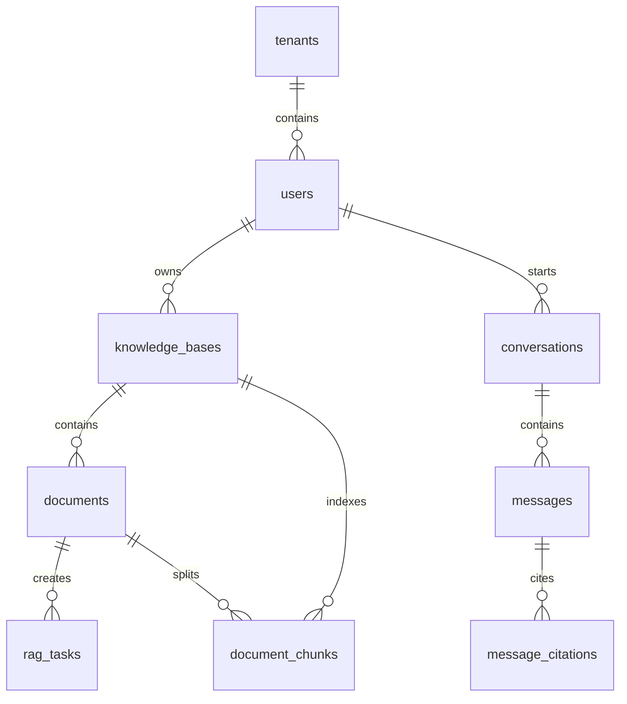

# 数据库设计

## 数据库选型

当前版本使用 PostgreSQL 16 + pgvector。业务数据、任务数据、会话数据和向量数据都存储在同一个数据库中，便于 MVP 快速运行和调试。

启用扩展：

```sql
CREATE EXTENSION IF NOT EXISTS vector;
CREATE EXTENSION IF NOT EXISTS pgcrypto;
```

## 核心表

| 表 | 说明 |
| --- | --- |
| `tenants` | 租户表，当前版本默认租户 |
| `users` | 用户表 |
| `roles` | 角色表，内置 `ADMIN`、`USER` |
| `user_roles` | 用户角色关系 |
| `knowledge_bases` | 知识库 |
| `knowledge_base_members` | 知识库成员权限预留 |
| `documents` | 上传文档元数据 |
| `rag_tasks` | 异步任务 |
| `document_chunks` | 文档切片和向量 |
| `conversations` | 会话 |
| `messages` | 消息 |
| `message_citations` | 消息引用来源 |
| `audit_logs` | 审计日志预留 |

## 关键关系



## document_chunks

`document_chunks` 是 RAG 检索的核心表：

| 字段 | 说明 |
| --- | --- |
| `tenant_id` | 租户隔离 |
| `knowledge_base_id` | 知识库隔离 |
| `document_id` | 来源文档 |
| `chunk_index` | 文档内切片序号 |
| `content` | 切片文本 |
| `metadata_json` | 元数据 JSON 字符串 |
| `embedding vector(1536)` | 向量 |

索引：

```sql
CREATE INDEX idx_chunks_kb ON document_chunks(knowledge_base_id);
CREATE INDEX idx_chunks_doc ON document_chunks(document_id);
CREATE INDEX idx_chunks_content_trgm ON document_chunks USING gin (to_tsvector('simple', content));
CREATE INDEX idx_chunks_embedding ON document_chunks USING hnsw (embedding vector_cosine_ops);
```

## 任务状态

`rag_tasks` 保存文档入库任务：

- `PENDING`：待处理。
- `RUNNING`：处理中。
- `SUCCEEDED`：处理成功。
- `FAILED`：处理失败。

任务失败会记录 `error_message`，前端会展示简化错误和原始详情。

## 数据隔离

当前表结构普遍保留 `tenant_id`。第一版默认创建一个租户，后续可扩展为多租户切换、租户管理员和租户级资源隔离。

知识库隔离依赖：

- `documents.knowledge_base_id`
- `document_chunks.knowledge_base_id`
- `conversations.knowledge_base_id`

## 后续演进

- 若迁移到 MySQL + MyBatis-Plus，需要保留业务表结构语义，但向量字段迁移到独立向量数据库。
- 若引入 Milvus，`document_chunks` 可保留文本和元数据，向量写入 Milvus collection。
- 若引入 OpenSearch，可承载关键词检索、全文检索和 BM25。
